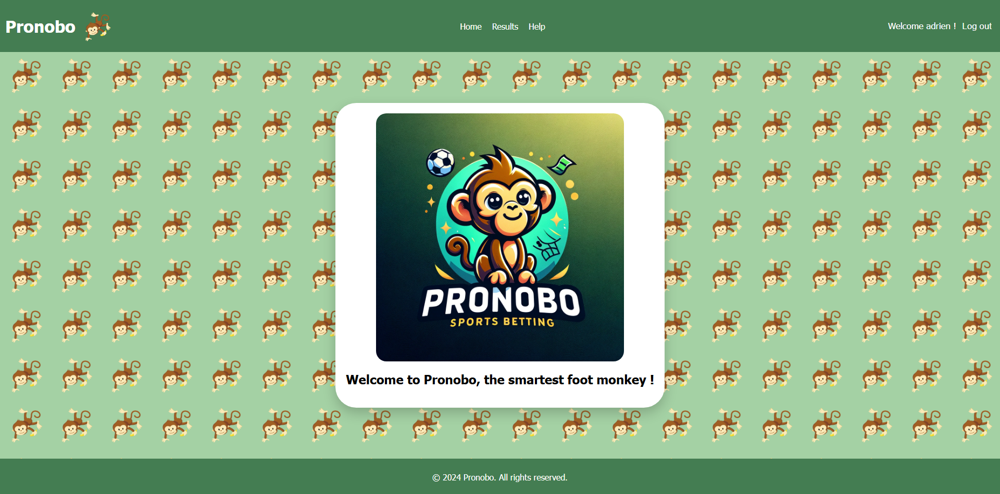

# 🏆 Pronobo


**Pronobo** is a web application developed with **Flask** that predicts football match results using **scraping and machine learning** techniques. It allows users to enter Eurosport links to generate predictions and track team trends.

## 📌 Features

✅ **Match result prediction**: Analysis and anticipation of match winners.  
✅ **Simple and intuitive interface**: Designed for a smooth user experience.  
✅ **User management**: Ability to log in, register, and administer accounts.  
✅ **Data updates**: Automatic retrieval of the latest results to improve accuracy.  

## 🚀 Installation & Execution

### 1️⃣ Clone the repository

```bash
git clone https://github.com/0adri3n/pronobo.git
cd pronobo
```

### 2️⃣ Create a virtual environment and install dependencies

```bash
python3 -m venv venv
source venv/bin/activate  # On Windows, use venv\Scripts\activate
pip install -r requirements.txt
```

### 3️⃣ Run the application

```bash
flask run
```

The application will be accessible at `http://127.0.0.1:5000/`.

## 📊 Usage



1. **Enter the URL**: Provide a Eurosport link to fetch match data.
2. **Prediction**: The algorithm analyzes the data and displays expected results.
3. **Explore results**: View previous predictions and statistics.


## 🏅 Prediction Results


## ⚙️ Technologies Used

- **Flask** 🐍: Python web framework.
- **SQLite** 🗄️: Database for storing users and results.
- **Scraping & Machine Learning** 🤖: Fetching and analyzing match data.

## 🔐 User Management

- **Admin**: Can manage accounts and update the database.
- **User**: Can enter links, view predictions, and log in.

## 📜 License

Open-source project under the **MIT** license.

---

💡 *Want to contribute? Feel free to open an issue or pull request!*
