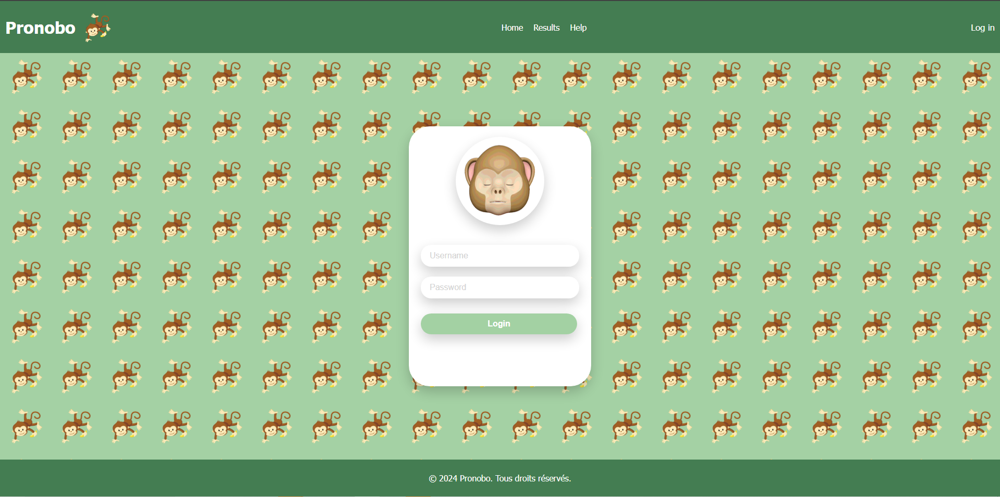
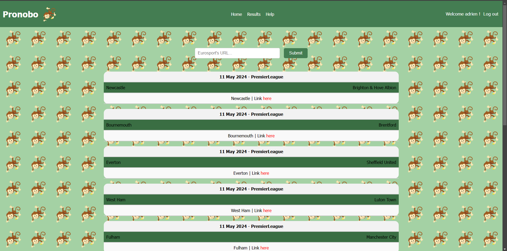

# 🏆 Pronobo


**Pronobo** est une application web développée avec **Flask** qui prédit les résultats de matchs de football en se basant sur des techniques de **scraping et de machine learning**. Elle permet aux utilisateurs d'entrer des liens Eurosport pour générer des prédictions et suivre les tendances des équipes.

## 📌 Fonctionnalités

✅ **Prédiction des résultats** : Analyse et anticipation des vainqueurs de matchs.  
✅ **Interface simple et intuitive** : Conçue pour une expérience utilisateur fluide.  
✅ **Gestion des utilisateurs** : Possibilité de se connecter, de s'inscrire et d'administrer les comptes.  
✅ **Mise à jour des données** : Récupération automatique des derniers résultats pour améliorer la précision.  

## 🚀 Installation et Exécution

### 1️⃣ Cloner le dépôt

```bash
git clone https://github.com/0adri3n/pronobo.git
cd pronobo
```

### 2️⃣ Créer un environnement virtuel et installer les dépendances

```bash
python3 -m venv venv
source venv/bin/activate  # Sur Windows, utilisez venv\Scripts\activate
pip install -r requirements.txt
```

### 3️⃣ Lancer l'application

```bash
flask run
```

L'application sera accessible à l'adresse `http://127.0.0.1:5000/`.

## 📊 Utilisation


1. **Saisie de l'URL** : Entrer un lien Eurosport pour récupérer les données du match.
2. **Prédiction** : L'algorithme analyse les données et affiche les résultats attendus.
3. **Exploration des résultats** : Visualisation des prédictions précédentes et des statistiques.



## 🏅 Résultats des Prédictions



## ⚙️ Technologies utilisées

- **Flask** 🐍 : Framework web Python.
- **SQLite** 🗄️ : Base de données pour stocker les utilisateurs et résultats.
- **Scraping & Machine Learning** 🤖 : Récupération et analyse des données de matchs.

## 🔐 Gestion des utilisateurs

- **Admin** : Peut gérer les comptes et mettre à jour la base de données.
- **Utilisateur** : Peut entrer des liens, voir les prédictions et se connecter.

## 📜 Licence

Projet open-source sous licence **MIT**.

---

💡 *Envie de contribuer ? N'hésitez pas à ouvrir une issue ou une pull request !*
